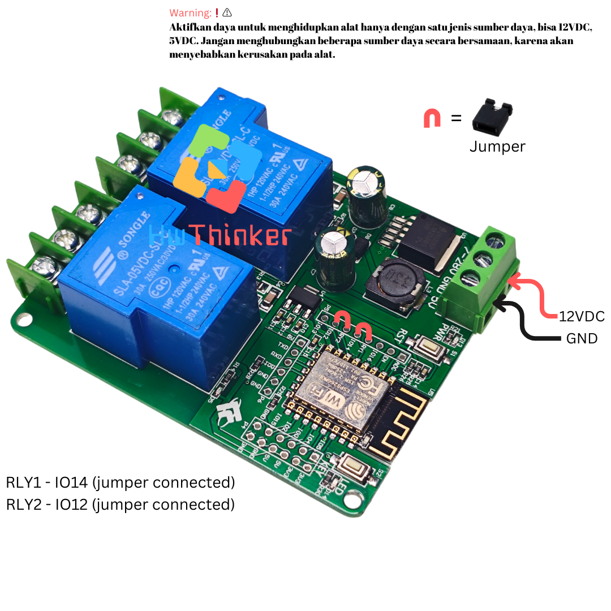
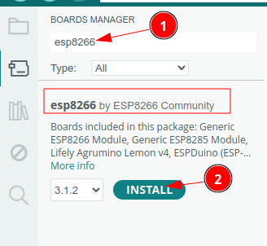
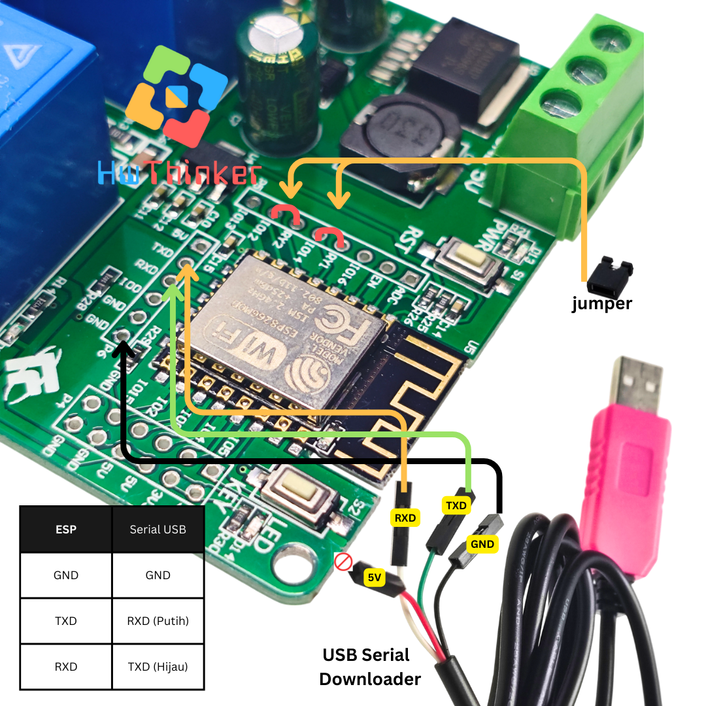
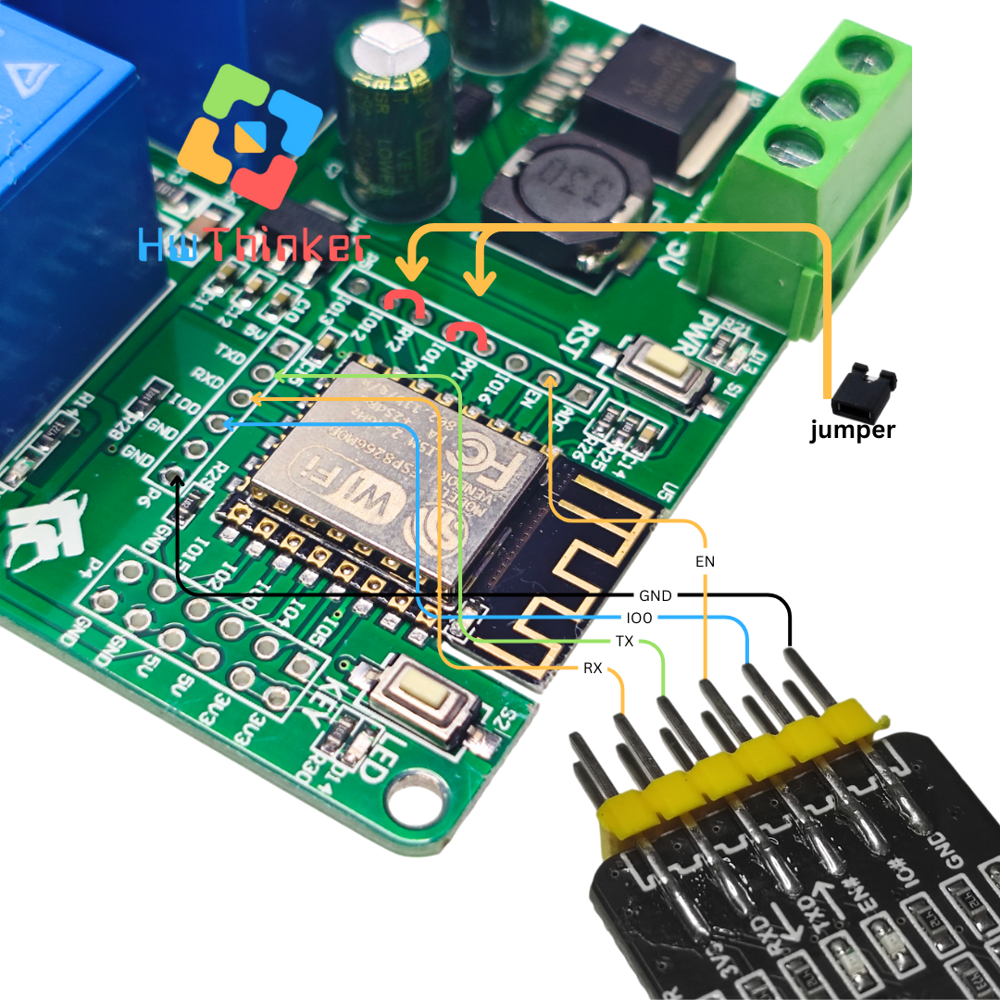

# Modul ESP8266 Relay 2 Channel 30A



Board ESP8266 (ESP-12F) dengan dua relay 30A onboard — cocok untuk beban arus tinggi seperti pompa air atau kompresor. Relay dikendalikan lewat GPIO 14 (RLY1) dan GPIO 12 (RLY2), tapi **butuh jumper manual** (lihat bagian Aktivasi Relay) karena tidak tersambung ke GPIO secara default.

## Cara install plugin Arduino IDE

### Langkah 1: Buka Arduino IDE

1. Buka aplikasi Arduino IDE di komputer Anda. Jika belum ada, unduh dan instal Arduino IDE dari situs resmi Arduino di https://www.arduino.cc/en/software. disarankan menggunakan arduino ide versi 2

### Langkah 2: Tambahkan URL Board Manager untuk ESP8266

2. Di Arduino IDE, buka **File** > **Preferences**.

   

3. Pada bagian  Additional Boards Manager URLs, tambahkan URL berikut:

```
https://arduino.esp8266.com/stable/package_esp8266com_index.json
```

4. Jika sebelumnya Anda sudah memiliki URL lain di sana, pisahkan URL ini dengan tanda koma atau baris baru.


### Langkah 3: Buka Boards Manager

1. Buka **Tools** > **Board** > **Boards Manager**.


2. Di kotak pencarian, ketik **ESP8266**

### Langkah 4: Instal Board ESP8266

1. Temukan **ESP8266 by Espressif Systems** di daftar, kemudian klik **Install**.



2. Tunggu hingga proses instalasi selesai.

### Langkah 5: Pilih Board ESP8266

1. Setelah instalasi selesai, Anda dapat memilih board ESP8266.
2. Buka **Tools** > **Board**, dan gulir ke bawah untuk menemukan berbagai jenis board ESP8266 yang telah diinstal. Pilih board yang sesuai, misalnya **Nodemcu 1.0 (ESP-12E Module)** 


3. hasilnya kurang lebih seperti ini


### Langkah 6: Pilih Port

1. Sambungkan board esp8266 ke komputer Anda menggunakan kabel USB.
2. Di **Tools** > **Port**, pilih port yang sesuai dengan esp8266 Anda.

## Kode Program

```c++
#include <Arduino.h>

#define LED_ESP 2
#define RLY1 14
#define RLY2 12


const int relayPins[] = {RLY1, RLY2};
const int numRelays = sizeof(relayPins) / sizeof(relayPins[0]);
const int delayTime = 1000;  // Waktu delay dalam milidetik

void setup() {
  pinMode(LED_ESP, OUTPUT);
  for (int i = 0; i < numRelays; i++) {
    pinMode(relayPins[i], OUTPUT);
    digitalWrite(relayPins[i], LOW);  // Matikan semua relay pada awal
  }
  digitalWrite(LED_ESP, LOW);  // Matikan LED pada awal
}

void loop() {
  digitalWrite(LED_ESP, HIGH);  // Nyalakan LED saat RLY1 aktif
  for (int i = 0; i < numRelays; i++) {
    digitalWrite(relayPins[i], HIGH);  // Nyalakan relay
    delay(delayTime);

    digitalWrite(relayPins[i], LOW);  // Matikan relay
  }
  digitalWrite(LED_ESP, LOW);  // Matikan LED setelah RLY4 mati
  delay(delayTime);
}
```

## Aktivasi relay

Default relay tidak terhubung ke ESP8266. Agar relay terhubung ke esp8266 pastikan memasang jumper RLY1 ke IO14 dan RLY2 ke IO12


## Cara download dengan Serial USB biasa



- Pasang serial USB TTL dengan ketentuan: 
   - TX -> RX USB Serial (Kabel Putih)
   - RX -> TX USB Serial (Kabel Hijau)
   - GND -> GND USB Serial (Kabel Hitam)
- Pastikan supply DC 12VDC  dihubungkan Terminal block pin dengan label 7-28V
- Pastikan GND supply dihubungkan dengan GND 
- Tekan dan tahan tombol key pada Keyboard 
- klik (tekan dan lepas) tombol RST dan pastikan  tombol key masih di tekan
- Lepas tombol key
- Download program dan tunggu sampai selesai
- klik tombol RST untuk run-program (langkah ini penting agar firmware baru dijalankan)
- ulang langkah awal bila melakukan download ulang lagi


## Cara download dengan Serial USB Auto Download


- Pasang serial USB TTL dengan ketentuan:
    - RX -> RX USB Serial  
    - TX -> TX USB Serial 
    - GND -> GND USB Serial  
    - IO0 -> IO# USB Serial 
    - EN -> EN# USB Serial
- Pastikan supply DC 12VDC  dihubungkan Terminal block pin dengan label 7-28V
- Pastikan GND supply dihubungkan dengan GND 
- Download program dan tunggu sampai selesai


## Warning:❗⚠️
Aktifkan daya untuk menghidupkan alat hanya dengan satu jenis sumber daya, bisa 12VDC atau 5VDC. Jangan menghubungkan beberapa sumber daya secara bersamaan, karena akan menyebabkan kerusakan pada alat.

> [!NOTE]
> Untuk serial disarankan menggunakan modul USB-TTL yang mendukung "auto download" — otomatis mengatur EN/IO0 saat upload sehingga tidak perlu pasang-lepas jumper manual tiap kali upload.